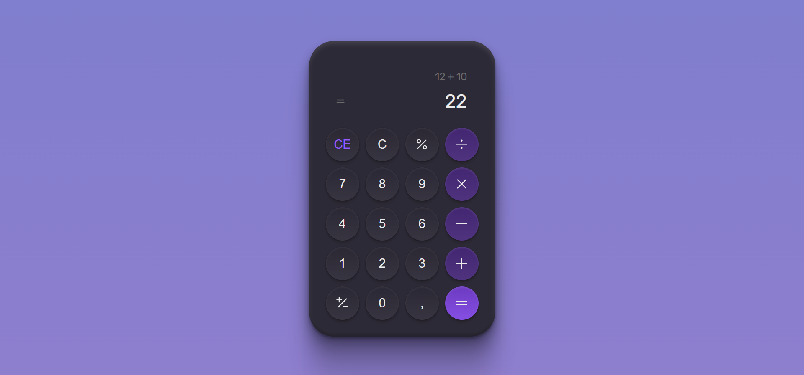

<h1 align="center">Calculator Rocketseat<h1>



<br>
<br>

## 🧪 Technologies

This project was developed using the following technologies:

- [HTML](https://developer.mozilla.org/en-US/docs/Web/HTML)
- [CSS](https://developer.mozilla.org/pt-BR/docs/Web/CSS)
- [JavaScript](https://developer.mozilla.org/en-US/docs/Web/JavaScript)
- [Git and Github](https://docs.github.com/pt)

## 🚀 Getting started

Clone the project and acess the folder.

````bash
$ git clone https://github.com/weslleyolli/Calculator-challenger-rocketseat
$ cd calculator-challenger-rocketseat
````


### Start the web project
Open index.html in browser.


## 🔖 Layout

You can view the project layout through the links below:

- [Layout](<https://www.figma.com/file/9wL8ZfLMzPlZQ37cJqAx6b/%23boraCodar---Desafio-5-(Community)?node-id=0%3A1&t=5uWy4pdz72nwboOt-0>)

Remembering that you need to have a [Figma](http://figma.com/) account to access it.

---

Made with 💜 by [Weslleyolli](https://github.com/weslleyolli)👋